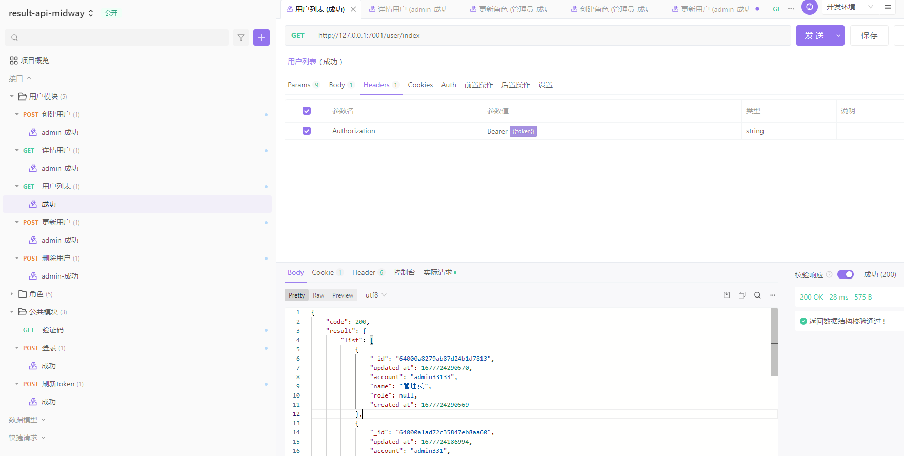

# 基于 Midwayjs 后端接口一体化模板
  + 可直接进行二开 避免重复造轮子 搭建基础服务模块等


## 内置功能
  + 业务模块：用户管理、角色管理、权限验证
  + 知识点模块：中间件、全局验证、全局错误、自定义错误、参数验证、验证码、mongodb、redis

### 写的很一般如有更好的ts类型 和 实际业务逻辑调整 欢迎提pr 共同改进

### 本系列采用 mongodb、 mysql（后期打算）

### 目前api接口:(apifox )网页版即可调试
  + https://www.apifox.cn/apidoc/project-2373272/api-65399834
  + 

### 项目结构：
```text
├── src 主程序逻辑
├   ├── config 配置
├   ├── constant 常量定义 目前只有code响应码 和 message 消息内容
├   ├── controller 控制器
├   ├── dto 参数验证
├   ├── entity 模型 mongodb
├   ├── filter 全局过滤器、参数过滤器、404过滤器
├   ├── guard （待完善）账号验证
├   ├── middleware 中间件 定义响应的内容体
├   ├── service 服务
├   ├── model.service.ts 封装的mongodb分页查询
├   ├── types 自定义的 ts类型 一塌糊涂
├   ├── utils 自定义的一些扩展
```

### 开发环境

| 技术 | 说明 | 版本 |
| ---- | ---- | ---- |
| Nodejs | node项目的运行环境 | 16+ |
| Redis | 缓存存储程序 | 6+ |
| mongodb | 数据存储程序 | 4+ |

<!-- add docs here for user -->

see [midway docs][midway] for more detail.

### Development

```bash
$ npm i
$ npm run dev
$ open http://localhost:7001/
```

### Deploy

```bash
$ npm start
```

### 交流讨论 共同改进


### npm scripts

- Use `npm run lint` to check code style.
- Use `npm test` to run unit test.


[midway]: https://midwayjs.org
